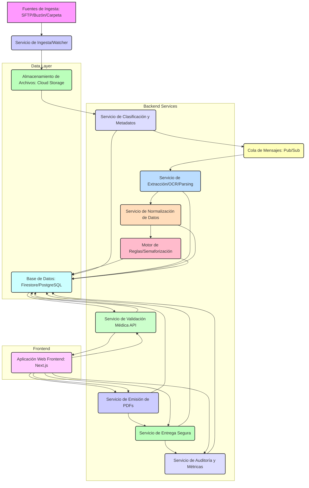

# 03 - Diseño Técnico Inicial RD-AMI

## 1. Arquitectura General

La arquitectura propuesta para RD-AMI es una arquitectura de microservicios o servicios basados en funciones (serverless), desplegada en la nube, con un frontend desacoplado. Esto permite escalabilidad, resiliencia y flexibilidad en la elección de tecnologías para cada componente.

## 2. Tecnologías Propuestas

### 2.1. Frontend (Aplicación Web)
*   **Framework:** Next.js (React Framework) con TypeScript.
*   **Estilizado:** Tailwind CSS para utilidades de CSS, shadcn/ui (basado en Radix UI) para componentes UI accesibles y personalizables.
*   **Animaciones:** Framer Motion para interacciones fluidas.
*   **Despliegue:** Firebase Hosting o Vercel (para Next.js).

### 2.2. Backend (Servicios/APIs)
*   **Lenguaje/Runtime:** Node.js (TypeScript) o Python (FastAPI/Flask) para los microservicios/funciones.
*   **Servicios de Ingesta/Watcher:** Cloud Functions/Cloud Run (GCP) o AWS Lambda/Azure Functions, con triggers para monitoreo de almacenamiento o colas.
*   **Servicio de Extracción/OCR/Parsing:** Python con librerías como `pdfminer.six`, `PyMuPDF`, `Tesseract` (para OCR si es necesario), o servicios de IA de GCP (Document AI).
*   **Motor de Reglas:** Implementación de un motor de reglas declarativo (ej. JSON Rules Engine en Node.js/Python).
*   **APIs:** RESTful APIs para la comunicación entre el frontend y los servicios de backend, implementadas con Express.js (Node.js) o FastAPI (Python).
*   **Autenticación/Autorización:** Firebase Authentication o Google Identity Platform para gestión de usuarios y roles.

### 2.3. Capa de Datos
*   **Almacenamiento de Archivos (PDFs):** Google Cloud Storage (GCS) para alta disponibilidad y durabilidad de los PDFs originales y generados.
*   **Base de Datos (Metadatos y Datos Estructurados):**
    *   **Firestore (NoSQL):** Para metadatos de expedientes, configuraciones de usuarios, logs de auditoría, debido a su escalabilidad y facilidad de integración con Firebase.
    *   **PostgreSQL (SQL):** Como alternativa para datos relacionales complejos, especialmente si se requiere una fuerte consistencia y relaciones complejas entre entidades (ej. perfiles de empresas, reglas clínicas).
*   **Cola de Mensajes:** Google Cloud Pub/Sub para la comunicación asíncrona entre servicios, garantizando la entrega de eventos y desacoplamiento.

### 2.4. Herramientas de Desarrollo y Operación
*   **Control de Versiones:** Git.
*   **Gestión de Proyectos:** GitHub/GitLab/Bitbucket.
*   **CI/CD:** GitHub Actions, GitLab CI/CD, Cloud Build (GCP).
*   **Contenedores:** Docker (para servicios desplegados en Cloud Run o Kubernetes si se escala).
*   **Observabilidad:** Google Cloud Logging, Cloud Monitoring, Cloud Trace para logs, métricas y tracing distribuido.

## 3. Consideraciones No Funcionales

### 3.1. Seguridad
*   **Cifrado:** Datos en reposo (Cloud Storage, Bases de Datos) y en tránsito (TLS/SSL para todas las comunicaciones).
*   **Control de Acceso:** Implementación de RBAC (Role-Based Access Control) para usuarios y servicios, con el principio de mínimos privilegios.
*   **Autenticación:** Uso de OAuth 2.0/OpenID Connect.
*   **Protección de Datos:** Cumplimiento con LFPDPPP y NOM-024-SSA3-2012. Anonimización/pseudonimización de datos sensibles cuando sea posible.
*   **Auditoría:** Registro inmutable de todas las operaciones críticas.

### 3.2. Escalabilidad
*   **Horizontal:** Los servicios de backend (Cloud Functions/Run) escalarán automáticamente según la demanda.
*   **Bases de Datos:** Firestore y Cloud Storage ofrecen escalabilidad inherente. PostgreSQL puede escalarse con Cloud SQL.
*   **Frontend:** Next.js permite renderizado del lado del servidor (SSR) y generación estática (SSG) para mejorar el rendimiento y la escalabilidad.

### 3.3. Disponibilidad y Resiliencia
*   **Alta Disponibilidad:** Despliegue en múltiples zonas/regiones de GCP.
*   **Recuperación ante Desastres:** Estrategias de backup y restauración para bases de datos y almacenamiento de archivos (RPO 24h, RTO 8h para piloto).
*   **Manejo de Errores:** Implementación de reintentos, circuitos de interrupción y colas de mensajes para manejar fallos transitorios.

### 3.4. Observabilidad
*   **Logging:** Logs estructurados y centralizados para todos los servicios.
*   **Monitoring:** Métricas de rendimiento, errores y uso de recursos para cada componente.
*   **Tracing:** Trazabilidad de solicitudes a través de los microservicios para depuración y optimización.
*   **Alertas:** Configuración de alertas para eventos críticos o umbrales de rendimiento.

### 3.5. Rendimiento
*   **Optimización de Consultas:** Indexación adecuada en bases de datos.
*   **Caché:** Implementación de caché en el frontend y/o en la capa de API para datos frecuentemente accedidos.
*   **Procesamiento Asíncrono:** Uso de colas de mensajes para tareas de procesamiento intensivo (OCR, generación de PDFs) para no bloquear la interfaz de usuario.

## 4. Integraciones Externas
*   **Servicios de IA:** OpenAI API (para asistentes como Aria/Inés en Continue Hub, si se integran directamente en el flujo de trabajo o para tareas específicas de procesamiento de lenguaje natural).
*   **Servicios de Correo:** SendGrid, Mailgun o similar para el envío de notificaciones y enlaces seguros.
*   **SFTP:** Posible integración con un servidor SFTP para la ingesta de archivos.

## 5. Riesgos Técnicos y Mitigaciones
*   **Complejidad de Extracción de PDFs:** Mitigación mediante el desarrollo iterativo de plantillas de anclas, uso de IA avanzada (Document AI) y la validación humana obligatoria.
*   **Latencia en Procesamiento de IA:** Mitigación con procesamiento asíncrono y optimización de los modelos/servicios de IA.
*   **Gestión de Identidad y Acceso:** Uso de plataformas robustas como Firebase Auth/Google Identity Platform y estricta aplicación de RBAC.
*   **Costos de Infraestructura Cloud:** Monitoreo constante de costos, optimización de recursos y uso de servicios serverless que escalan a cero.
