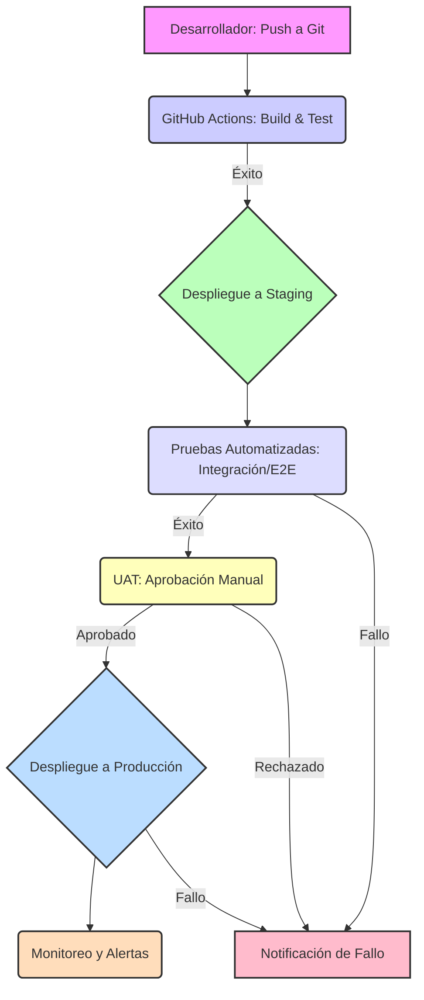

# 05 - Estrategia de Despliegue RD-AMI

## 1. Introducción

Este documento describe la estrategia de despliegue para el sistema RD-AMI, enfocándose en un enfoque basado en la nube para garantizar escalabilidad, fiabilidad y eficiencia operativa. La estrategia se alinea con las tecnologías propuestas y las consideraciones no funcionales definidas en el diseño técnico inicial.

## 2. Principios de Despliegue

*   **Cloud-Native:** Aprovechar al máximo los servicios gestionados de la nube (GCP) para reducir la carga operativa.
*   **Automatización:** Implementar pipelines de CI/CD para automatizar la construcción, prueba y despliegue de los componentes.
*   **Inmutabilidad:** Desplegar artefactos inmutables (imágenes de contenedores, funciones serverless) para garantizar la consistencia entre entornos.
*   **Observabilidad:** Integrar herramientas de logging, monitoring y tracing desde el inicio para una visibilidad completa del sistema en producción.
*   **Despliegues de Bajo Riesgo:** Utilizar estrategias de despliegue que minimicen el impacto en los usuarios finales (ej. Blue/Green, Canary) cuando sea apropiado.

## 3. Entornos de Despliegue

Se definirán al menos tres entornos principales para el ciclo de vida del desarrollo y despliegue:

*   **Desarrollo (Dev):** Entorno local para desarrolladores. Puede incluir emuladores de servicios cloud.
*   **Staging (Pre-producción):** Entorno que replica la producción lo más fielmente posible. Utilizado para pruebas de integración, funcionales, rendimiento y UAT. Los datos pueden ser anonimizados o sintéticos.
*   **Producción (Prod):** Entorno en vivo que sirve a los usuarios finales. Altamente disponible y monitoreado.

## 4. Componentes y Estrategias Específicas

### 4.1. Frontend (Next.js)
*   **Plataforma:** Vercel (recomendado para Next.js) o Firebase Hosting (GCP).
*   **Estrategia:**
    *   **CI/CD:** Configuración de pipelines para que cada push a la rama `main` (o `release`) dispare un build y despliegue automático al entorno de Staging.
    *   **Producción:** Despliegue manual o con aprobación a Producción después de UAT exitosa.
    *   **SSR/SSG:** Aprovechar las capacidades de Next.js para Server-Side Rendering (SSR) y Static Site Generation (SSG) para optimizar el rendimiento y la escalabilidad del frontend.

### 4.2. Backend (Microservicios/Funciones)
*   **Plataforma:** Google Cloud Run (para servicios basados en contenedores) o Google Cloud Functions (para funciones serverless).
*   **Estrategia:**
    *   **CI/CD:** Pipelines automatizados para construir imágenes de Docker (si se usa Cloud Run), ejecutar pruebas unitarias/de integración y desplegar nuevas versiones a Staging.
    *   **Producción:** Despliegue a Producción con estrategias de lanzamiento gradual (ej. revisión de tráfico en Cloud Run) o Blue/Green para minimizar el riesgo.
    *   **Versionado:** Cada despliegue generará una nueva versión del servicio/función, permitiendo rollbacks rápidos.

### 4.3. Bases de Datos (Firestore/PostgreSQL)
*   **Plataforma:** Firestore (NoSQL gestionado) o Cloud SQL for PostgreSQL (SQL gestionado).
*   **Estrategia:**
    *   **Staging/Producción:** Instancias separadas para cada entorno.
    *   **Migraciones:** Utilizar herramientas de migración de esquemas (ej. Flyway para PostgreSQL) gestionadas a través de pipelines de CI/CD.
    *   **Backups:** Configuración de backups automáticos y point-in-time recovery.

### 4.4. Almacenamiento de Archivos (Google Cloud Storage)
*   **Plataforma:** Google Cloud Storage (GCS).
*   **Estrategia:**
    *   **Buckets:** Buckets separados para Staging y Producción, con políticas de ciclo de vida y control de versiones de objetos.
    *   **Seguridad:** Configuración de permisos de acceso granular y cifrado en reposo.

### 4.5. Colas de Mensajes (Google Cloud Pub/Sub)
*   **Plataforma:** Google Cloud Pub/Sub.
*   **Estrategia:**
    *   **Topics/Subscriptions:** Topics y subscriptions dedicados para cada entorno.
    *   **Dead-Letter Queues (DLQ):** Configuración de DLQs para manejar mensajes que no pueden ser procesados, mejorando la resiliencia.

## 5. Pipeline de CI/CD (Ejemplo con GitHub Actions)

## 6. Rollback

En caso de problemas en Producción, se implementarán mecanismos de rollback rápido:

*   **Frontend:** Revertir a una versión anterior en Vercel/Firebase Hosting.
*   **Backend:** Revertir a una versión anterior del servicio/función en Cloud Run/Cloud Functions.
*   **Bases de Datos:** Restaurar a un punto de recuperación anterior (si la migración de esquema es compatible con la versión anterior del código).

## 7. Monitoreo y Alertas Post-Despliegue

Una vez desplegado, el sistema será monitoreado activamente utilizando:

*   **Google Cloud Monitoring:** Para métricas de rendimiento y salud de los servicios.
*   **Google Cloud Logging:** Para la agregación y análisis de logs.
*   **Google Cloud Trace:** Para el seguimiento de solicitudes a través de los microservicios.
*   **Alertas:** Configuración de alertas para notificar al equipo sobre errores, latencia elevada o uso inusual de recursos.

## 8. Próximos Pasos

*   Definición detallada de los pipelines de CI/CD.
*   Configuración de los entornos de Staging y Producción en GCP.
*   Implementación de scripts de despliegue para cada componente.
